# 1：使用autodl作为解释器

设置——项目：你的项目——Python解释器——添加解释器——SSH
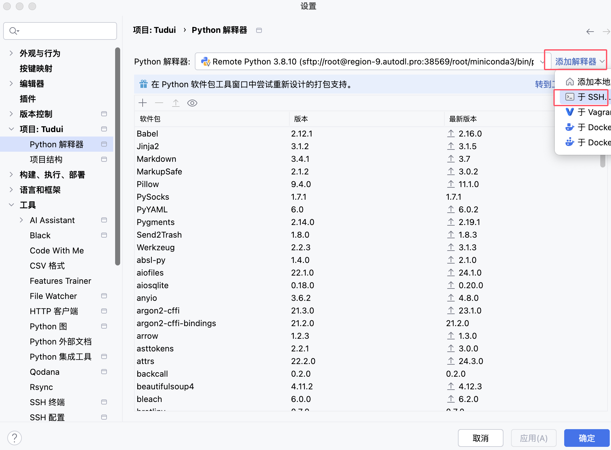

填写autodl中的用户名、主机、端口、密码
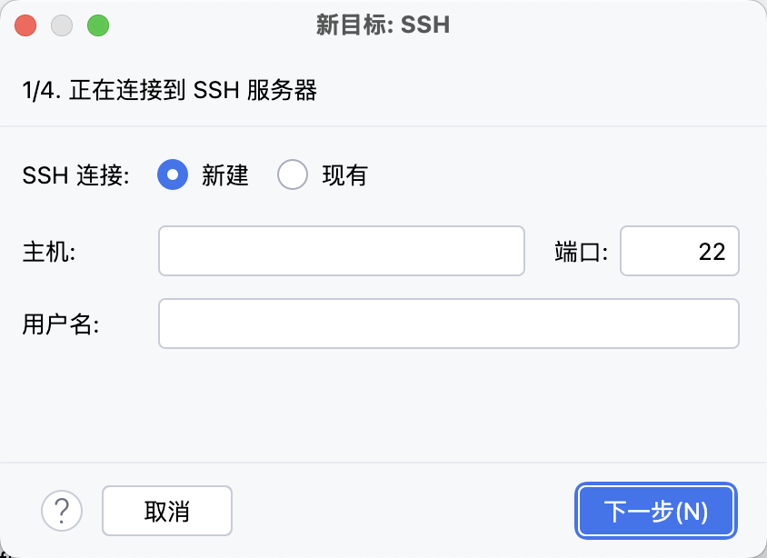

选择系统解释器/System Interpreter  
解释器/Interpreter：远程服务器的python解释器地址/相当于本地conda环境中的一格  
同步文件/Sync folders：本地现在的项目地址 与  远程服务器中哪个目录关联同步
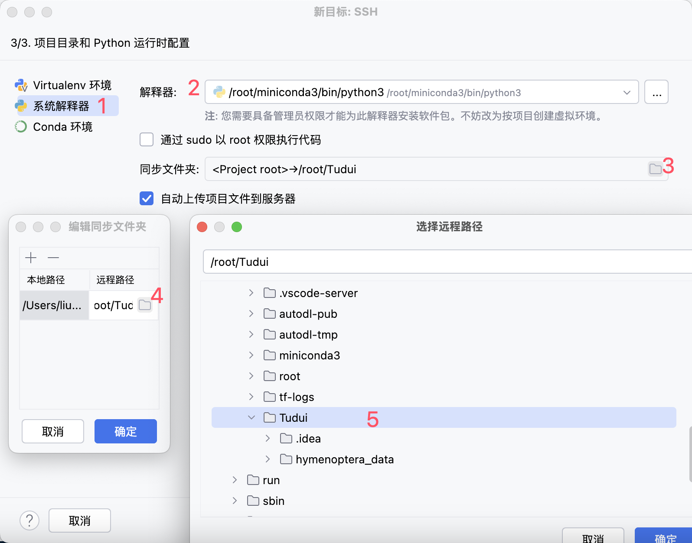

这时候已经训练模型的时候使用的是autodl中的A100了

注意！！！
因为使用的是远程服务器了，所以路径也切换成远程服务器了，不能使用本地数据集的路径！！！
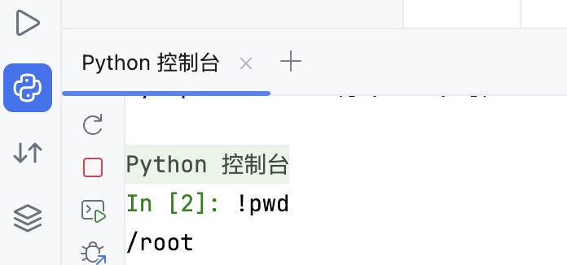

# 2：实现本地项目目录与远程项目目录映射绑定

工具——部署——配置——连接
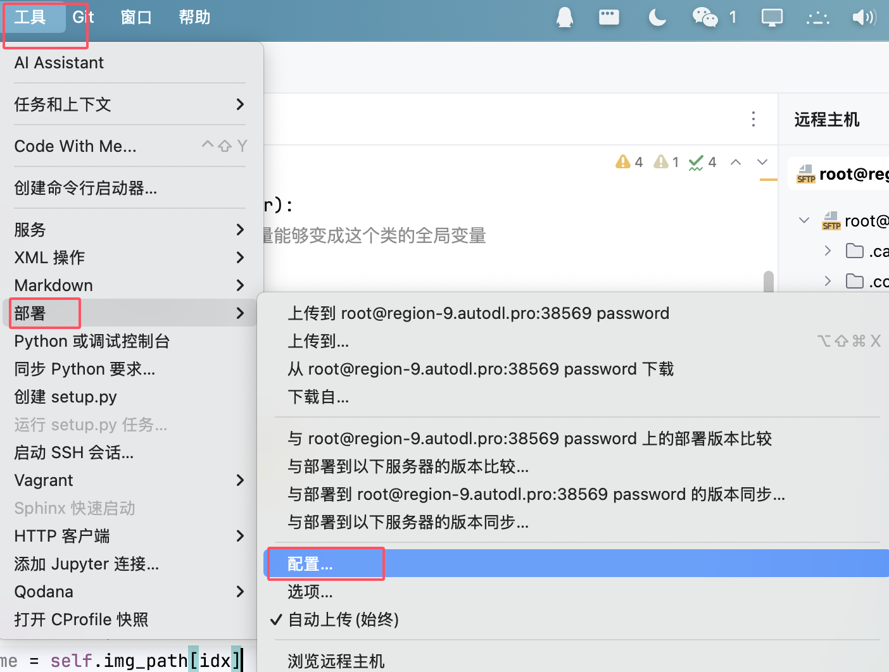
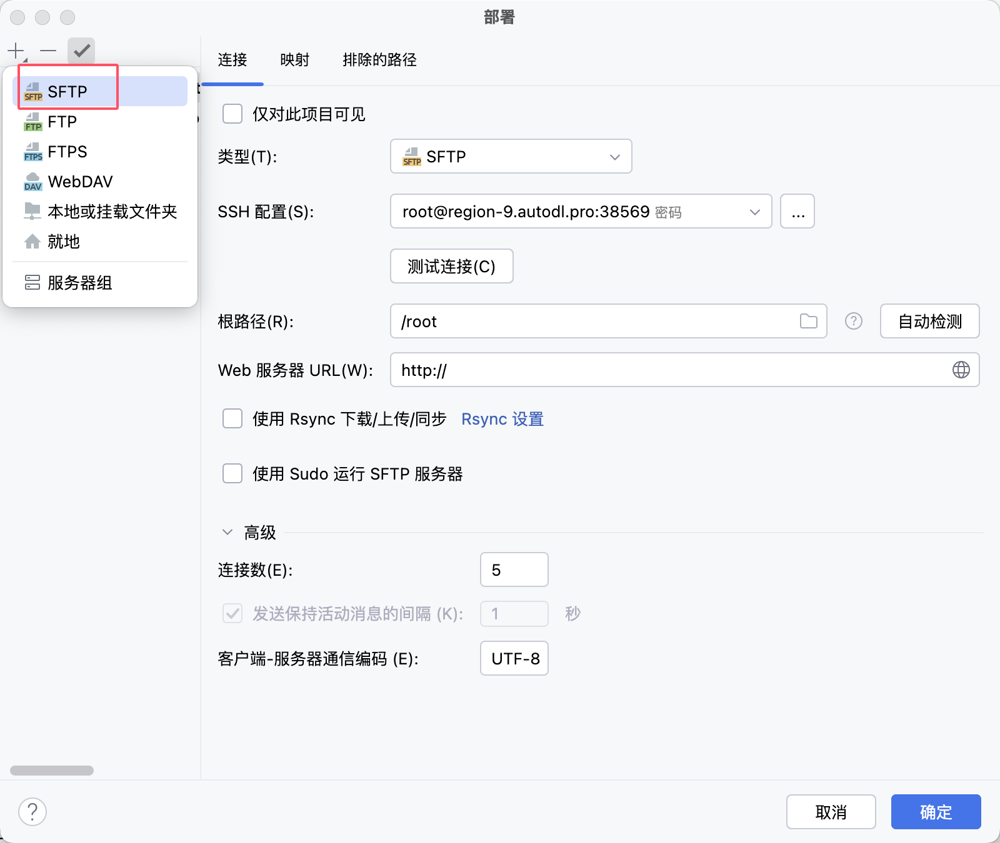
根路径选择哪个在远程主机中就显示哪个目录
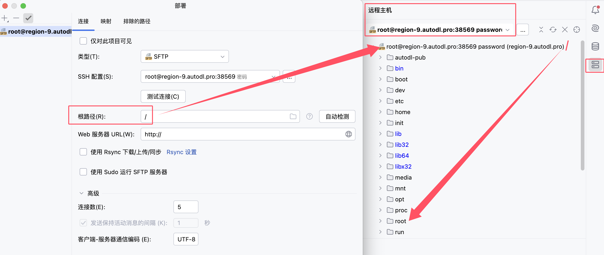
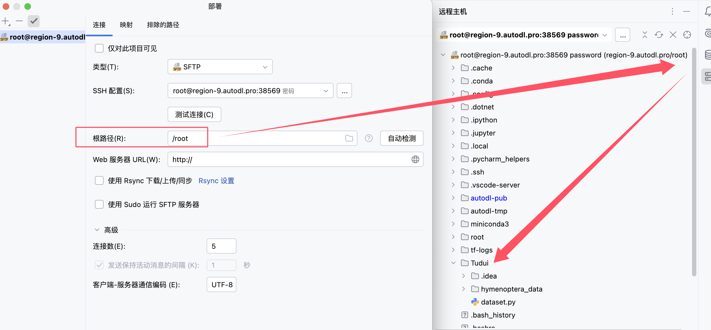
工具——部署——配置——映射
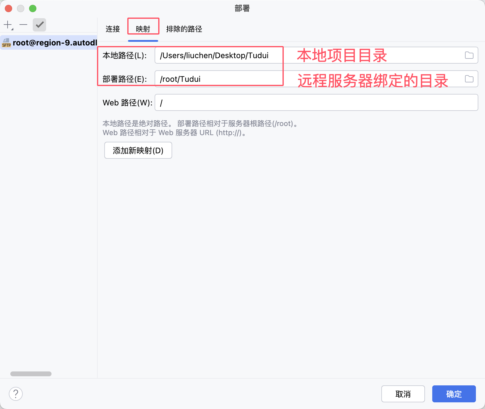

# 3：在相互绑定以后本地代码更改远程也改的实时同步
同居——部署——选项
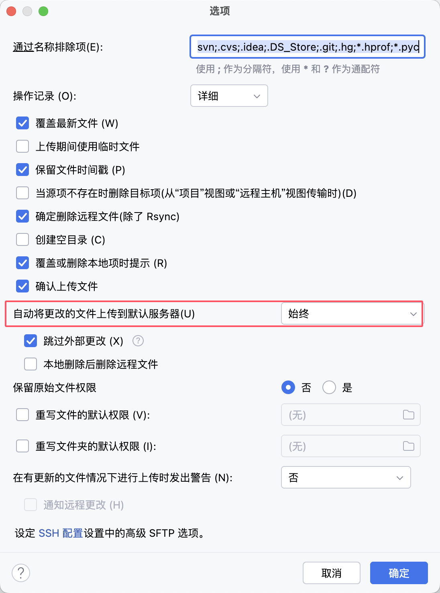
设置——工具——SSH配置
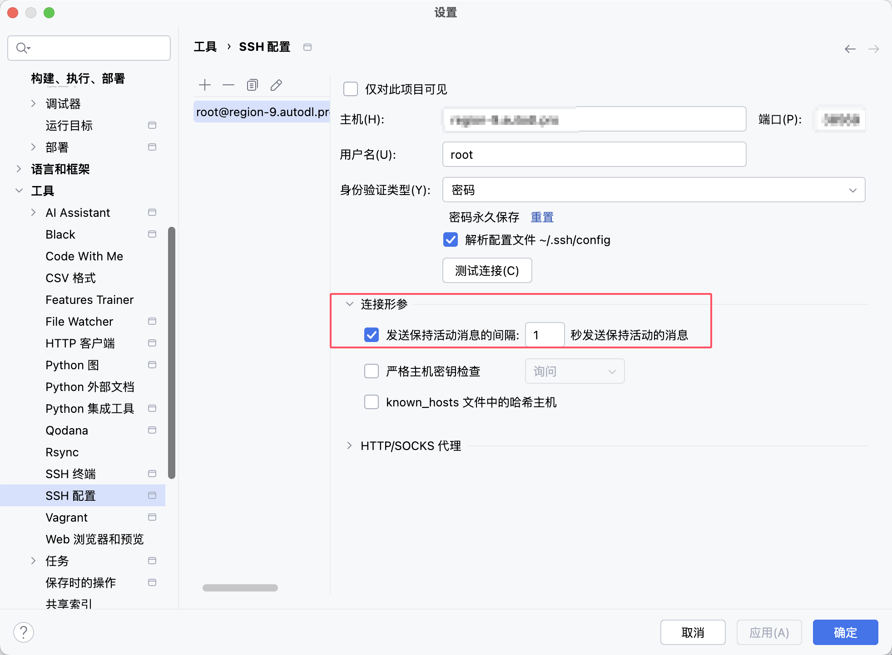

# 4：验证
本地添加一个test.py以后
远程也添加了test.py
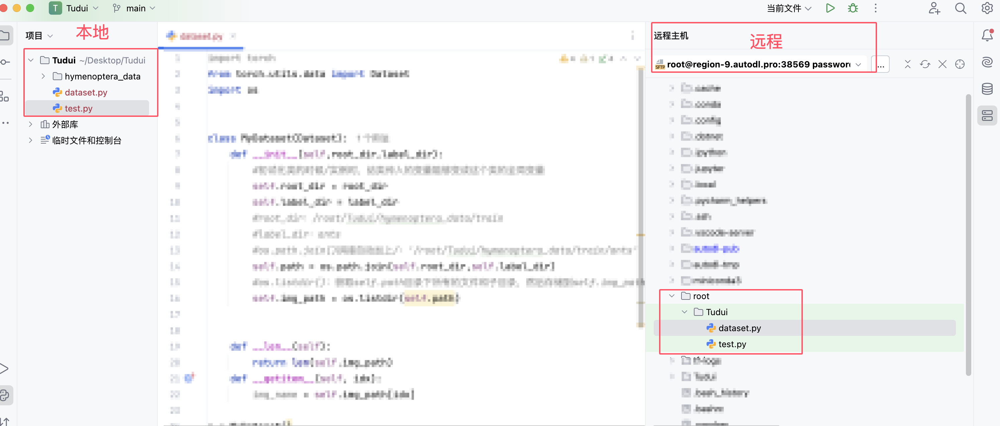
得益于：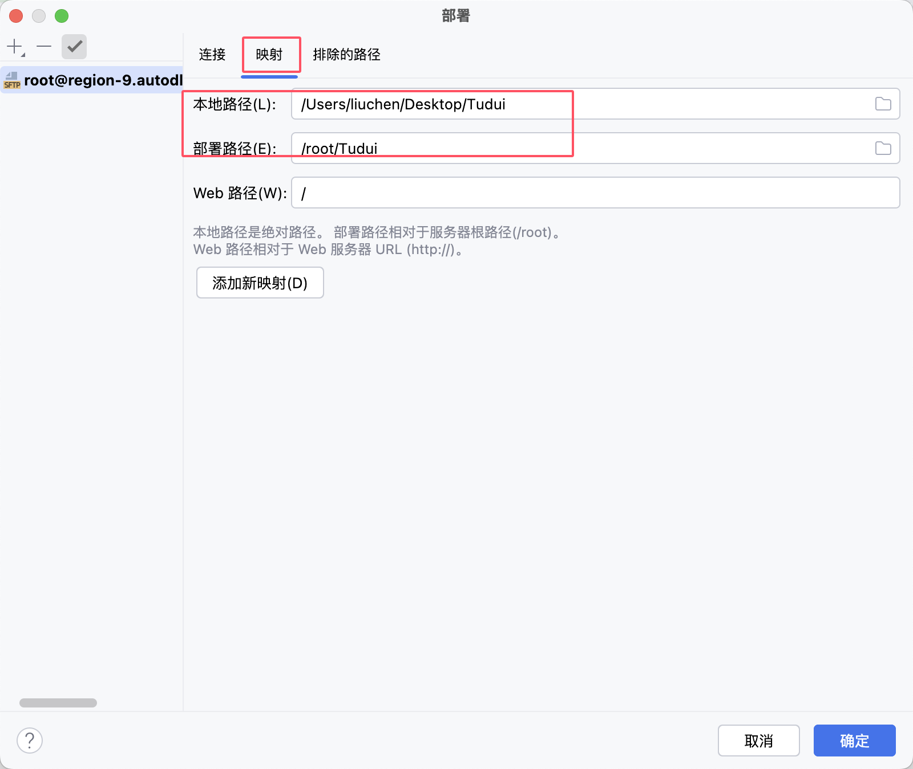

